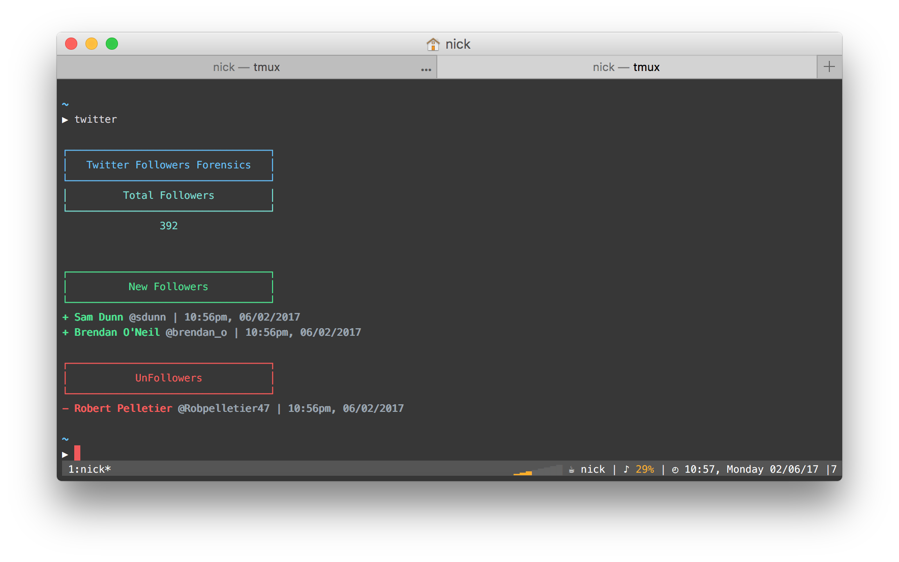

<p align="center">
	<br>
	
</p>

Twitter Forensics
-----------------

Record and track some Twitter related information regarding your followers.

Usage
-----

```
$ git clone git@github.com:nickzuber/twitter-forensics.git
$ cd twitter-forensics
```

Update the configuration constants to match your credentials.

```js
const MY_TWITTER_USER_ID = 402143571  // Your Twitter user ID
const MAX_USERS_TO_DISPLAY = 5        // Number of users for forensics reporting
```

Then just link and use at the command line.

```
$ npm link
$ twitter

  Usage: twitter [command]


  Options:

    -V, --version  output the version number
    -h, --help     output usage information


  Commands:

    unfollowers  find the people who've recently unfollowed you
    nonmutuals   find the people who you follow and aren't following you back
```

License
-------
MIT (c) Nick Zuber
