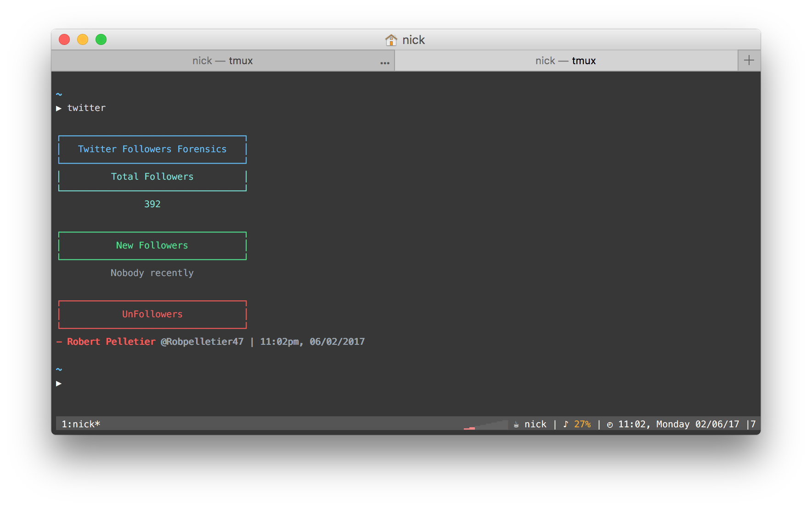

<p align="center">
	<br>
	
</p>

Twitter Forensics
-----------------

Record and track some Twitter related information regarding your followers.

Usage
-----

```
$ git clone git@github.com:nickzuber/twitter-forensics.git
$ cd twitter-forensics
```

Update the configuration constants to match your credentials.

```js
const MY_TWITTER_USER_ID = 402143571  // Your Twitter user ID
const MAX_USERS_TO_DISPLAY = 5        // Number of users for forensics reporting
```

Then just run the script.

```
$ npm run-script run
```

Or you can do what I do and create some type of alias for this script.

```bash
function twitter {
  node ~/custom_scripts/twitter-forensics
}
```

License
-------
MIT (c) Nick Zuber
